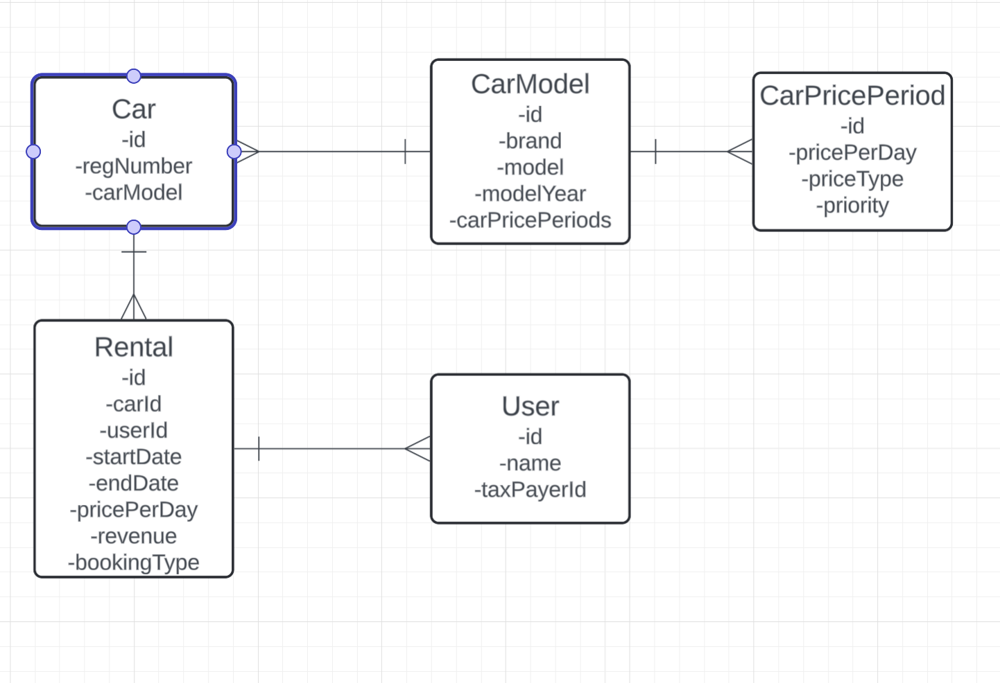

# Admin
GET api/admin/rentals

# Rentals
GET api/rental/models 

GET api/rental/available


Parameters: startDate, endDate, carModelId (optional. If provided, only available cars of that model will be returned)

POST api/rental/rent
```json
{
  "bookingType": "ONLINE",
  "carModelId": 1,
  "startDate": "2023-10-01",
  "endDate": "2023-10-05",
  "user": {
    "id": 1,
    "name": "Jane Doe",
    "dateOfBirth": "1979-08-08"
  }
}
```
* BookingType can be either ONLINE or MANUAL. (10% discount for ONLINE bookings)
* Date format is YYYY-MM-DD.
* dateOfBirth must be at least 18 years old.

Database Model


